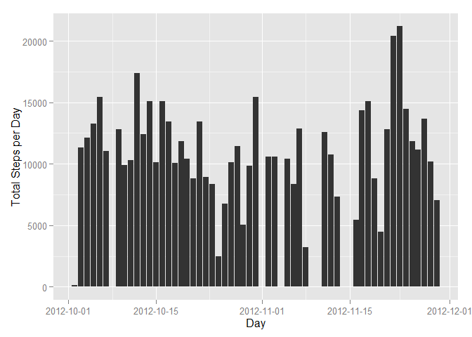
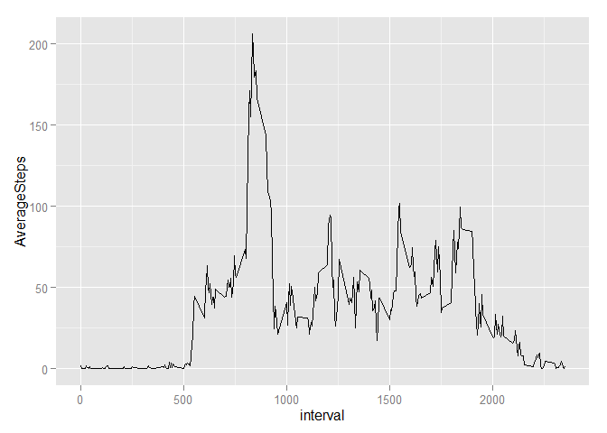
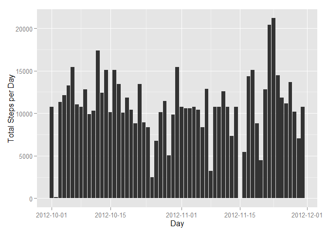
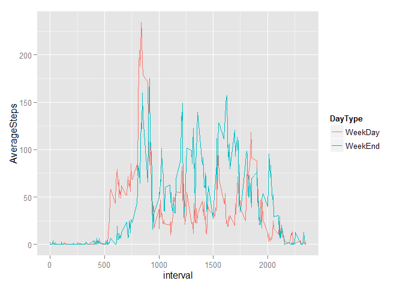

# Reproducible Research: Peer Assessment 1


## Loading and preprocessing the data
- Unzip and load data from activity.zip. Assume activity.zip is in working directory.
- Format date field in raw data as proper R Date.

```r
rawData<-read.csv(unz("activity.zip","activity.csv"))
rawData$date <- as.Date(rawData$date , "%Y-%m-%d")
```

## What is mean total number of steps taken per day?

Create Histogram to display total number of steps per day
To do this, we need to filter the NA (missing values) from the dataSet.


```r
library(dplyr)
```

```
## Warning: package 'dplyr' was built under R version 3.1.3
```

```
## 
## Attaching package: 'dplyr'
## 
## The following object is masked from 'package:stats':
## 
##     filter
## 
## The following objects are masked from 'package:base':
## 
##     intersect, setdiff, setequal, union
```

```r
data_df<-tbl_df(rawData)
NA_filtered_data=filter(data_df, !is.na(steps))
byDay <- group_by(NA_filtered_data,date)
TotalStepsPerDay <- summarize(byDay,TotalSteps=sum(steps))

library(ggplot2)
```

```
## Warning: package 'ggplot2' was built under R version 3.1.3
```

```r
library(scales)
```

```
## Warning: package 'scales' was built under R version 3.1.3
```

```r
StepsHistPlot<-ggplot(TotalStepsPerDay,aes(x=date, y=TotalSteps)) + geom_bar(stat = "identity") + labs(x = "Day", y = "Total Steps per Day") + scale_x_date(labels = date_format("%Y-%m-%d"))
print(StepsHistPlot)
```

 

The mean total number of steps taken per day = 1.0766189\times 10^{4}

The median total number of steps taken per day = 10765


## What is the average daily activity pattern?
- Ignores NA values

```r
bytime<-group_by(NA_filtered_data,interval)
AverageStepsPerTimeInterval <- summarize(bytime,AverageSteps=mean(steps))

StepsPerInterval<-ggplot(AverageStepsPerTimeInterval,aes(interval,AverageSteps)) + geom_line()
print(StepsPerInterval)
```

 

Interval which contains the maximum number of steps = 835.


## Imputing missing values
- Calculate and report the total number of missing values in the dataset (i.e. the total number of rows with NAs)

The total number of missing values = 2304

- Devise a strategy for filling in all of the missing values in the dataset. The strategy does not need to be sophisticated. For example, you could use the mean/median for that day, or the mean for that 5-minute interval, etc.

The strategy here is to fill the missing values with data based on the mean for the interval.

- Create a new dataset that is equal to the original dataset but with the missing data filled in.

New dataset with missing data filled in = FilledInData$NewSteps


```r
 FilledInData<-data_df
 for(i in unique(data_df$interval))
  {
     FilledInData<- mutate(FilledInData, steps=ifelse(interval==i&is.na(steps),AverageStepsPerTimeInterval[which(AverageStepsPerTimeInterval$interval == i),]$AverageSteps,steps))
     
  }

FilledInData
```

```
## Source: local data frame [17,568 x 3]
## 
##        steps       date interval
## 1  1.7169811 2012-10-01        0
## 2  0.3396226 2012-10-01        5
## 3  0.1320755 2012-10-01       10
## 4  0.1509434 2012-10-01       15
## 5  0.0754717 2012-10-01       20
## 6  2.0943396 2012-10-01       25
## 7  0.5283019 2012-10-01       30
## 8  0.8679245 2012-10-01       35
## 9  0.0000000 2012-10-01       40
## 10 1.4716981 2012-10-01       45
## ..       ...        ...      ...
```

- Make a histogram of the total number of steps taken each day and Calculate and report the mean and median total number of steps taken per day. Do these values differ from the estimates from the first part of the assignment? What is the impact of imputing missing data on the estimates of the total daily number of steps?


```r
FilledInDatabyDay <- group_by(FilledInData,date)
FilledInTotalStepsPerDay <- summarize(FilledInDatabyDay,TotalSteps=sum(steps))

FilledInStepsHistPlot<-ggplot(FilledInTotalStepsPerDay,aes(x=date, y=TotalSteps)) + geom_bar(stat = "identity") + labs(x = "Day", y = "Total Steps per Day") + scale_x_date(labels = date_format("%Y-%m-%d"))
print(FilledInStepsHistPlot)
```

 

The mean total number of steps taken per day = 1.0766189\times 10^{4}

The median total number of steps taken per day = 1.0766189\times 10^{4}

## Are there differences in activity patterns between weekdays and weekends?

Create a new factor variable in the dataset with two levels - "weekday" and "weekend" indicating whether a given date is a weekday or weekend day.

Make a panel plot containing a time series plot (i.e. type = "l") of the 5-minute interval (x-axis) and the average number of steps taken, averaged across all weekday days or weekend days (y-axis). See the README file in the GitHub repository to see an example of what this plot should look like using simulated data.


```r
WeekDayWeekEndData<-mutate(NA_filtered_data,DayType=ifelse(weekdays(date) %in% c("Sunday","Saturday"), "WeekEnd","WeekDay")) %>%
  group_by(interval,DayType) %>%
  summarize(AverageSteps=mean(steps))

StepsPerIntervalPerDayType<-ggplot(WeekDayWeekEndData,aes(interval,AverageSteps)) + geom_line(aes(color=DayType))
print(StepsPerIntervalPerDayType)
```

 
